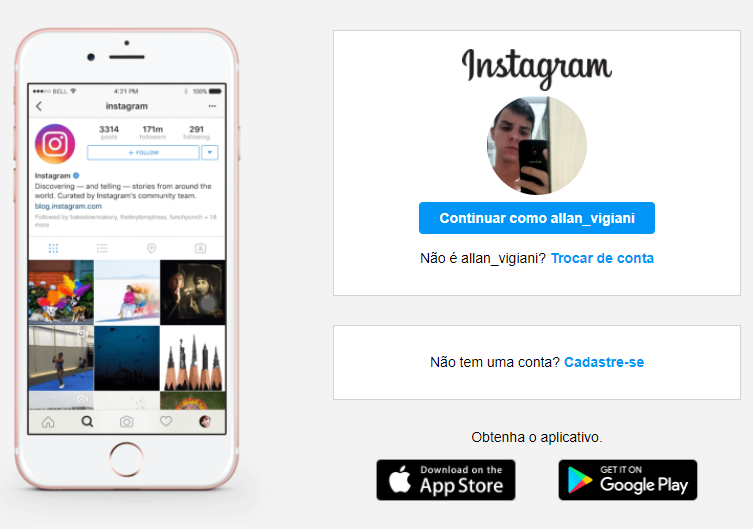
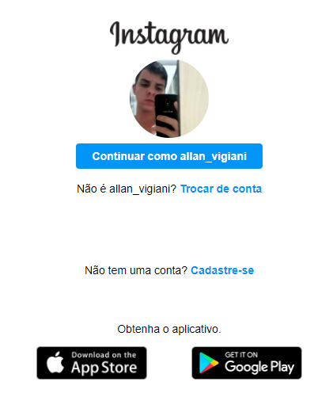

 

# instagram-login-clone
instagram-login-clone é um clona da tela de login do Instragram desktop com responsividade para dispositivos mobile.

## Índice
* [Tech](#tecnologias)
* [Screenshots](#screenshots)

## Sobre o projeto

<a href="https://allanvigiani.github.io/instagram-login-clone/">Clique aqui</a> para ver o projeto.

	
## Tecnologias
- HTML5
- CSS3

## Screenshots

